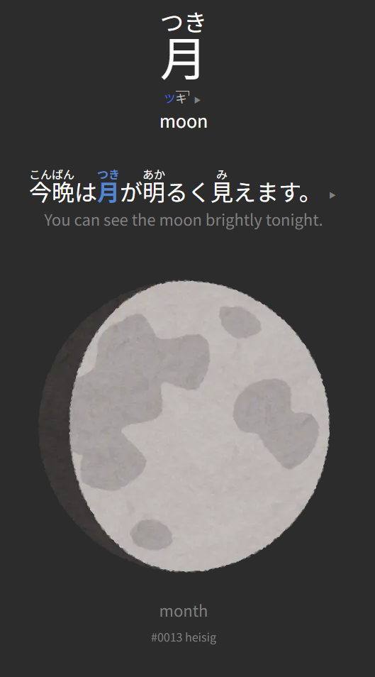

Small clanker script adding Heisig frame id's and keywords to a Kaishi deck.

Heisig frames are added as tags (only adding the highest id found in a *Word* field), allowing you to target corresponding Kaishi cards as you progress through RTK. Also adds keywords matching your vocabulary cards.

***This is for the 6th edition only. Check the script and csv if you want to use it with older editions!***



*Example of a heavily modified Kaishi back card template, with additional ``{{heisig-keyword}}`` and ``{{Tags}}`` info, provided by the script*

## Prerequisites 

**IF YOU'VE ALREADY STARTED A KAISHI DECK, MAKE A BACKUP OF IT**
1. Install Python with pip (ensure python is in your PATH)
2. Type ``pip install zstandard`` into your nearest terminal
3. [Download this csv](https://github.com/sdcr/heisig-kanjis/tree/master)
4. [Download the Kaishi 1.5k Anki deck](https://ankiweb.net/shared/info/1196762551)
5. Download ``enrich_apkg.py`` from this repo

**IF YOU'VE ALREADY STARTED A KAISHI DECK, MAKE A BACKUP OF IT**
## Setup

**IF YOU'VE ALREADY STARTED A KAISHI DECK, MAKE A BACKUP OF IT**

1. Import the original Kaishi 1.5k apkg into Anki.
2. *Browse*, click on any Kaishi card, and click on *Fields...* (bottom left, below the list)
3. Add the field *heisig-keyword*. Position shouldn't matter.
4. Back out of the browser, and click on the cog-wheel to the right of your Kaishi deck, then hit *Export* and give it a unique name (``heisig_kaishi.apkg`` for example)
5. Delete the Kaishi deck (cog-wheel > *Delete*)

*You should be able to add the required field to an already existing Kaishi deck, and export that for the next step. However, please, for the love of of god,*
**IF YOU'VE ALREADY STARTED A KAISHI DECK, MAKE A BACKUP OF IT**
## Running the script

1. Put the modified Kaishi apkg into a folder, alongside the csv you downloaded
2. Run the following command from a terminal

```
cd /path/to/your/folder
python enrich_apkg.py "heisig_kaishi.apkg" heisig-kanjis.csv
```

3. Import the newly created ``heisig_kaishi_enriched.apkg`` into Anki
4. Click *Browse* and check the results. If something went wrong, *oops, I blame the clanker,* delete the modified deck and re-import your backup or the original Kaishi.

## Adding a "kana-only" tag

1. Click *Browse*, click on your modified deck to the left, and input the following into the search bar:
   
   
```
Word:re:^[^一-龯]*$
```

   2. Select all cards with *Ctrl+A*, *right-click* > *Notes* > *Add Tags...* > *kana-only*

## Using the deck in conjunction with RTK

### Option 1 (Manually unsuspend cards with frames you've learned)
Click *Browse*, select your deck, search for `-tag:kana-only` and suspend all kanji cards (*Ctrl+A* > *right-click* > *Toggle suspend*). Next, either use the tag browser or a search for `tag:0000` (where `0000` is a Heisig frame from `0001` to `2200`), and unsuspend all cards with frames you've already learned. 

*Pro-Tip: If you are dealing with a large amount of frames, just let Google Search's AI build a search string for you. For example, prompt it with `anki search string for tags 0201 - 0500` and copy-pasta the regex you get.* 


In the deck's study options, set *New cards/day* to 0. Click on the deck, select *Custom Study* and select any option. 

Open the newly created Custom Deck, click *Options* and activate (at the bottom) *Enable second filter.* as well as *Reschedule cards based on my answers in this deck*.
Then change the search filters as follows:

Filter 1:
```
is:new "deck:YOUR DECK NAME" -tag:kana-only
```
Set the limit to something sensible. I prefer a Random card selection, but you can also just go with Kaishi's order of cards.

```
is:new "deck:YOUR DECK NAME" tag:kana-only
```
Set the limit to something sensible. There are roughly 180 cards without kanji in the deck. I prefer learning a handful each day, because learning a large batch of them all at once is kind of a pain.

Click Rebuild and you're done. Rename the deck, and go through it each day. Unsuspend cards as you learn new frames with RTK, and hit Rebuild whenever you want a new batch of cards.

### Option 2 (Filter out all cards with frames you've learned)
In the deck's study options, set *New cards/day* to 0. Click on the deck, select *Custom Study* > *Study card by state or tag* > *New cards only*. Select all tags up to your current RTK progress. 

Next, click on the newly created Custom Study deck. Select *Options* in the bottom left. Rename the deck to something appropriate, e.g. "RTK Frames 1-250" (this is important!). Set the *Limit to* 9999 and select *Random* from the dropdown menu to the right.

Below, click on *Enable second filter.* Enter the following in Filter 2's search box:

```
is:new "deck:YOUR DECK NAME" tag:kana-only
```

Set the limit to something appropriate (there are roughly 180 words without kanji in this deck), and ensure the order is set to *Random*. *We mix in kana vocab because we don't want to end up with 180 kanji-less cards waiting for us at the end of the queue.*  

Finally, ensure *Reschedule cards based on my answers in this deck* is activated and you are done. Hit *Rebuild* and start studying.

As you get through this filtered deck and answer cards, they will be returned to the main deck for future reviews. Don't burn through the entire stack of available cards all at once. Or do, I'm not your 母, *#105, mother, breasts*.

You can update this filtered deck as you learn new frames, or create separate filtered decks every *x* frames you learn with RTK, it's up to you. Just be prepared that you will outpace the Kaishi deck in no time. Totally normal, get RTK over with and don't try to keep both decks in perfect sync. 

When you finish RTK, delete the filtered deck(s) and all cards should return to the main deck. Don't forget to turn on *New cards* again, and you're set to continue your study without interruption.

## FAQ

#### Something is broken.
That sucks. I already burnt through my weekly tokens though, so please direct any bug reports to your nearest LLM. I truly have no clue about coding, and no interest in learning yet another vodoo language, sorry.

### Why not just use Wanikani?
You do you.

### Why not just use KKLC?
You do you.

### My favorite YouTuber said RTK is outdated and you should use this new cool service instead, Promo Code VSJAPAN to get 20% off your first month.
*Right-click* > *Don't recommend this channel*. Repeat until the mighty YT algorithm catches on.

### I'm a total beginner, should I start my journey with RTK?
Ehh, you do you. But honestly, probably not. Only do RTK if you have trouble recognizing and remembering kanji. Keep in mind that working through RTK will eat up a lot of your daily study time. Doing it in conjunction with Kaishi will take several hours out of your day, each day, for 2–3 months. Expect 90–120 minutes of pure reviews and learning new cards. If that sounds like a surefire way to kill your motivation, it’s because it is. A sustainable pace will beat any attempt at rushing through the first few hurdles the Japanese language presents.

